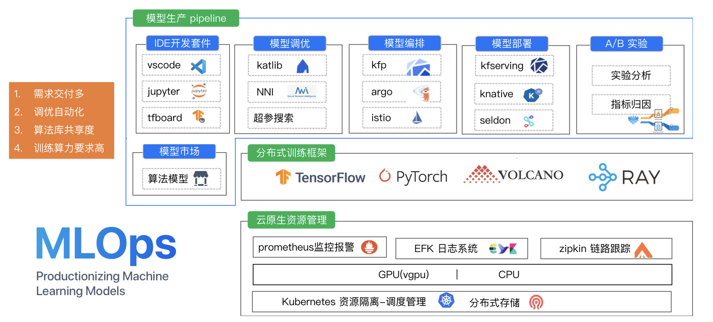

## Cube Studio deploy



#### 一、搭建目标

##### v0.0.0版本

​	cube-studio基础功能的构建，自定义镜像的创建(根据用户创建属于自己的容器环境)，ray-sklearn、xgb模板插件的安装

###### 组件说明

| 命名空间       | 组件名                            | 组件说明                                              |
| -------------- | --------------------------------- | ----------------------------------------------------- |
| infra          | kubeflow-dashboard-frontend       | cube-studio平台的web前端                              |
| infra          | kubeflow-dashboard                | cube-studio平台的web后端                              |
| infra          | kubeflow-dashboard-schedule       | 用来调度cube-studio系统自带的调度任务，比如定时清理   |
| infra          | kubeflow-dashboard-worker         | 用来执行cube-studio系统自带的调度任务，比如定时清理   |
| infra          | kubeflow-watch                    | 用来监控cube-studio平台中的任务，发起通知和信息更新   |
| infra          | mysql                             | 平台元数据的存储                                      |
| infra          | redis                             | 平台缓存，和异步任务对接                              |
| kube-system    | kubernetes-dashboard-cluster      | k8s中pod的管理界面                                    |
| kube-system    | dashboard-cluster-metrics-scraper | k8s中pod的管理界面上的pod资源使用情况的插件           |
| kube-system    | nvidia-device-plugin-daemonset    | k8s中使用机器gpu驱动和设备的插件                      |
| kube-system    | metrics-server                    | 集群资源使用情况的指标采集，用来在hpa时使用           |
| kube-system    | kubeflow-prometheus-adapter       | 用来将prometheus采集的指标转化为可以用来控制hpa的指标 |
| kubeflow       | frameworkcontroller               | nni超参搜索需要的分布式组件                           |
| kubeflow       | minio                             | 对象存储                                              |
| kubeflow       | train-operator                    | 分布式训练                                            |
| kubeflow       | workflow-controller               | argo 云原生调度                                       |
| istio-system   | istio-ingressgateway              | 入口网关，用来代理所有外部访问                        |
| istio-system   | 其他                              | istio基础组件                                         |
| monitoring     | dcgm-exporter                     | gpu机器资源监控                                       |
| monitoring     | node-exporter                     | cpu机器资源监控                                       |
| monitoring     | prometheus-k8s                    | 监控数据存储服务                                      |
| monitoring     | grafana                           | 监控数据可视化                                        |
| volcano-system | 全部                              | volcano分布式和批调度                                 |
| jupyter        | docker-*                          | 用户创建的在线构建镜像的pod                           |
| jupyter        | 其他                              | 用户创建的在线notebook                                |
| service        | 全部                              | 用户创建的内部服务和推理服务                          |
| pipeline       | 全部                              | 用户创建的pipeline任务                                |
| automl         | 全部                              | 用户创建的超参搜索任务                                |

#### 二、服务器资源基本环境

##### master：

​	**System：Ubuntu:18.04**

​	**Cpu:**

​	**Mem:**

##### node01:

​	**System：Ubuntu:18.04**

​	**Cpu:**

​	**Mem:**

#### 三、k8s部署

cube-studio是基于k8s的部署的一个学习平台.........

##### [（一）、安装Docker](./docker_installed.md)

##### [（二）、安装Harbor](./harbor_installed.md)

由于处于内网环境，而且为了未来方便管理D我们每个人的训练环境，需要安装一个管理镜像的插件Harbor。

##### [（三）、使用Racher安装k8s](./install/kubernetes/rancher)

使用Racher来安装k8s要比传统的安装简单很多，可以通过web界面来设置参数安装。

#### 四、部署cube-studio

在单机上将k8s的kubeconfig文件保存为
cube-studio/install/kubernetes/config，下面的命令换成自己的机器ip

```
cd cube-studio/install/kubernetes/
sh start.sh xx.xx.xx.xx
```

[单机部署参考视频](https://www.bilibili.com/video/BV18r4y147oj/)

部署脚本已集成到cube-studio/install/kubernetes/start.sh脚本中

#### start.sh脚本参数说明

#### 通过label进行机器管理  

开发训练服务机器管理：

- 对于cpu的train/notebook/service会选择cpu=true的机器  
- 对于gpu的train/notebook/service会选择gpu=true的机器  

- 训练任务会选择train=true的机器  
- notebook会选择notebook=true的机器  
- 服务化会选择service=true的机器  
- 不同项目的任务会选择对应org=xx的机器。默认为org=public 
- 可以通过gpu-type=xx表示gpu的型号

控制器机器管理：

- mysql=true 部署mysql服务的机器
- redis=true 部署mysql服务的机器
- kubeflow-dashboard=true 部署cube服务的机器
- kubeflow=true 部署kubeflow的机器
- istio=true 部署istio的机器
- knative=true 部署knative的机器
- monitoring=true 部署prometheus的机器

#### 分布式存储

目前机器学习平台依赖强io性能的分布式存储。  建议使用ssd的ceph作为分布式存储。并注意配置好开机自动挂载避免在机器重启后挂载失效

 ！！！重要：分布式文件系统需要挂载到每台机器的/data/k8s/下面，当然也可以挂载其他目录下，以软链的形式链接到/data/k8s/下 

需要每台机器都有对应的目录/data/k8s为分布式存储目录

```bash  
mkdir -p /data/k8s/kubeflow/minio  
mkdir -p /data/k8s/kubeflow/global  
mkdir -p /data/k8s/kubeflow/pipeline/workspace  
mkdir -p /data/k8s/kubeflow/pipeline/archives  
```

平台pvc会使用这些分布式存储目录下的subpath，所以如果你是rancher部署k8s集群，需要在kubelet容器中挂载主机的/data/k8s/目录到kubelet容器的/data/k8s/目录。
rancher修改kubelet容器挂载目录(选中集群-升级-编辑yaml)

```
    kubelet:
      extra_binds:
        - '/data:/data'
```

#### gpu环境的准备  

1、找运维同学在机器上安装gpu驱动  
2、安装nvidia docker2（k8s没有支持新版本docker的--gpu）  
3、修改docker配置文件  

```abash  
cat /etc/docker/daemon.json  
  
{  
    "insecure-registries":["docker.oa.com:8080"],  
    "default-runtime": "nvidia",  
    "runtimes": {  
        "nvidia": {  
            "path": "/usr/bin/nvidia-container-runtime",  
            "runtimeArgs": []  
        }  
    }  
}  
```

#### 如果是内网部署，需要先把镜像传递到私有仓库，再从私有仓库拉取到每台机器上  

```bash  
sh pull_image_kubeflow.sh  
```

#### 创建命名空间、秘钥(有私有仓库，自己添加)  

将本地的~/.kube/config文件换成将要部署的集群的kubeconfig  

```bash  
修改里面的docker hub拉取账号密码  
sh create_ns_secret.sh  
```

#### 部署k8s-dashboard  

新版本的k8s dashboard 可以直接开放免登陆的http，且可以设置url前缀代理  

```bash  
kubectl apply -f dashboard/v2.2.0-cluster.yaml  
kubectl apply -f dashboard/v2.2.0-user.yaml  
```

#### 部署元数据组件mysql  

参考mysql/readme.md  

#### 部署缓存组件redis  

参考redis/readme.md  

#### 部署kube-batch  

kube-batch用来实现gang调度  

```bash  
kubectl create -f kube-batch/deploy.yaml  
```

#### 部署prometheus生态组件  

参考prometheus/readme.md  

#### 部署efk生态组件  

参考efk/readme.md  

#### 部署frameworkercontroller组件  

参考frameworkercontroller/readme.md  

#### 部署volcano组件  

```bash
kubectl apply -f volcano/volcano-development.yaml
```

#### 部署kubeflow  

参考kubeflow/v1.2.0/readme.md  


#### 部署 管理平台  

如果涉及到多集群部署，修改kubeconfig中的文件，文件名为$cluster-config，并在每个集群中部署configmap

```bash
kubectl delete configmap kubernetes-config -n infra
kubectl create configmap kubernetes-config --from-file=kubeconfig -n infra

kubectl delete configmap kubernetes-config -n pipeline
kubectl create configmap kubernetes-config --from-file=kubeconfig -n pipeline

kubectl delete configmap kubernetes-config -n automl
kubectl create configmap kubernetes-config --from-file=kubeconfig -n automl
```


组件说明  

 - cube/base/deploy.yaml为myapp的前后端代码  
 - cube/base/deploy-schedule.yaml 为任务产生器  
 - cube/base/deploy-worker.yaml 为任务执行器  
 - cube/base/deploy-watch.yaml 任务监听器  

配置文件说明  

 - cube/overlays/config/entrypoint.sh 镜像启动脚本  
 - cube/overlays/config/config.py  配置文件，需要将其中的配置项替换为自己的  

部署入口  
cube/overlays/kustomization.yml    

修改kustomization.yml中需要用到的环境变量。例如HOST为平台的域名，需要指向istio ingressgate的服务(本地调试可以写入到/etc/hosts文件中)  

部署执行命令  

```bash  
为部署控制台容器的机器添加lable,  kubeflow-dashboard=true
kubectl apply -k cube/overlays  
```

#### 部署pv-pvc.yaml  

```bash  
kubectl create -f pv-pvc-infra.yaml  
kubectl create -f pv-pvc-jupyter.yaml  
kubectl create -f pv-pvc-automl.yaml  
# kubectl create -f pv-pvc-kubeflow.yaml  
kubectl create -f pv-pvc-pipeline.yaml  
kubectl create -f pv-pvc-service.yaml  
```

#### 部署平台入口  

```bash  
# 创建8080网关服务  
kubectl apply -f gateway.yaml  
# 创建新的账号需要  
kubectl apply -f sa-rbac.yaml          
# 修改并创建virtual。需要将其中的管理平台的域名批量修改为平台的域名
kubectl apply -f virtual.yaml  
```

#### kube-scheduler调度策略

可以参考 https://docs.qq.com/doc/DWFVqcFd0S29WUGxD


#### 版本升级

数据库升级，数据库记录要批量添加默认值到原有记录上，不然容易添加失败

#### ray-sklearn、xgb模板插件的安装

安装方法[如下](./job-template/README.md)
