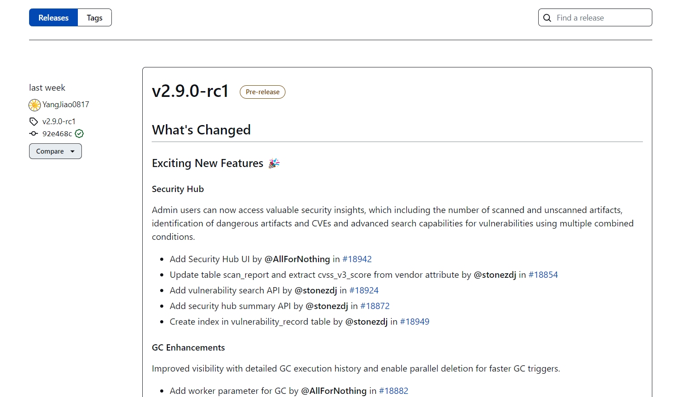
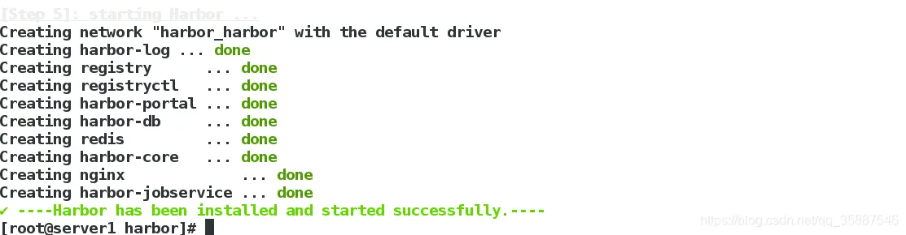
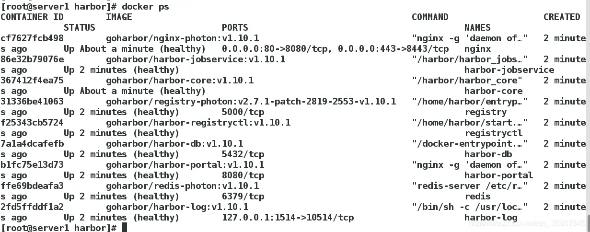
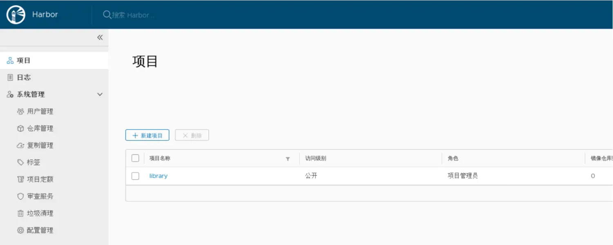
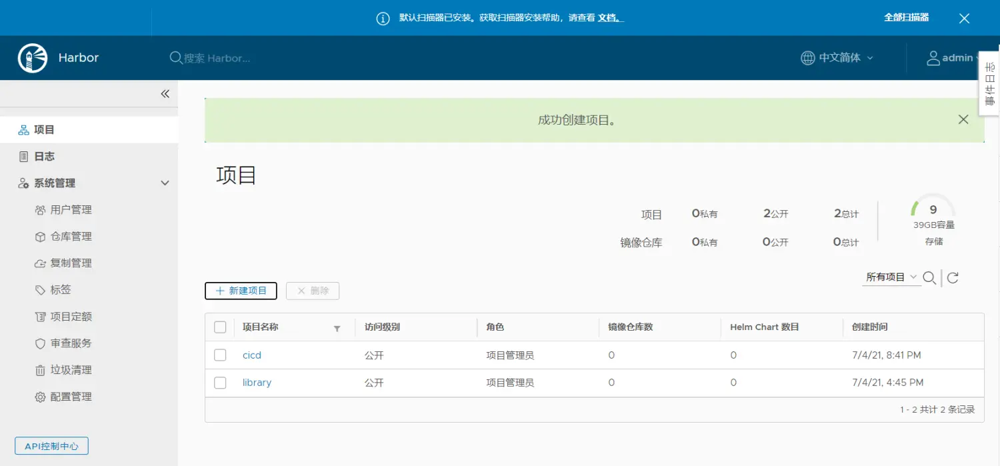
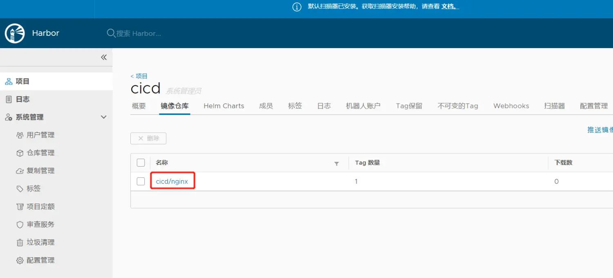

# Harbor安装教程

### 一、确保在ubuntu系统上安装Compose

在Linux上，您可以从[GitHub上](https://github.com/docker/compose/releases)的[Compose存储库发行页面](https://github.com/docker/compose/releases)下载Docker Compose二进制文件。按照链接中的说明进行操作，其中包括在终端中运行`curl`命令以下载二进制文件。这些分步说明也包含在下面。

> 对于`alpine` ，需要以下依赖包： `py-pip` ， `python-dev` ， `libffi-dev` ， `openssl-dev` ， `gcc` ， `libc-dev`和`make` 。

1. 运行以下命令以下载Docker Compose的当前稳定版本：

   ```
   sudo curl -L "https://github.com/docker/compose/releases/download/1.25.0/docker-compose-$(uname -s)-$(uname -m)" -o /usr/local/bin/docker-compose
   ```

   > 要安装其他版本的Compose， `1.25.0`用您要使用的Compose版本替换`1.25.0` 。

   如果使用`curl`安装时遇到问题，请参见上方的“ [备用安装选项”](https://docs.docker.com.zh.xy2401.com/compose/install/#alternative-install-options)标签。

2. 将可执行权限应用于二进制文件：

   ```
   sudo chmod +x /usr/local/bin/docker-compose
   ```

> **注意** ：如果命令`docker-compose`在安装后失败，请检查路径。您也可以创建指向`/usr/bin`或路径中任何其他目录的符号链接。

例如：

```
sudo ln -s /usr/local/bin/docker-compose /usr/bin/docker-compose
```

1. （可选）为`bash`和`zsh` shell安装[命令完成](https://docs.docker.com.zh.xy2401.com/compose/completion/) 。

2. 测试安装。

   ```
   $ docker-compose --version
   docker-compose version 1.25.0, build 1110ad01
   ```

## 二、安装

### 1、下载安装包

下载地址：[https://github.com/goharbor/harbor/releases](https://links.jianshu.com/go?to=https%3A%2F%2Fgithub.com%2Fgoharbor%2Fharbor%2Freleases)
 直接选择编译好的包


 这里有两个包Harbor offline installer 和 Harbor online installer，两者的区别的是 Harbor offline installer 里就包含的 Harbor 需要使用的镜像文件

下载成功，并解压

```csharp
[root@master ~]# tar zxf harbor-offline-installer-v1.10.1.tgz -C /data/
```

进入解压的目录，并 ls

```csharp
[root@master ~]# cd /data/harbor/
[root@master harbor]# ls
common.sh  harbor.v1.10.1.tar.gz  harbor.yml  install.sh  LICENSE  prepare
```

### 2、编辑配置文件

harbor.yml 就是harbor的配置文件 harbor的数据目录为/data
 编辑harbor.yml，修改hostname为fjut.ai.com、https证书路径、admin密码

.webp)

这里选择http模式所以将https注释掉

证书的制作可以参考：https://www.jianshu.com/p/721455035190

注意：每次修改完配置文件后都需要运行

```csharp
[root@master harbor]# ./prepare 
```

运行 ./install.sh

```csharp
[root@master harbor]# ./install.sh 
```



运行成功docker ps 查看，可以看到服务已经起来



### 常用管理命令


```undefined
停止服务： docker-compose stop
开始服务： docker-compose start
重启服务：docker-compose restart
停止服务并删除容器：docker-compose down
启动服务并运行容器：docker-compose up
```

注意：这些命令均要在harbor目录下运行

### 三、GUIl界面使用

浏览器访问https://harbor域名地址

.webp)

输入用户名admin，密码admin登陆



新建一个命名为cicd项目，并设置访问级别为公开



这里的项目就是一私有化的Docker镜像仓库，默认的仓库是library

### 四、本机上传拉取镜像

1、修改Docker配置
 docker 默认是按 https 请求的
 修改文件 /etc/docker/daemon.json

```csharp
[root@master harbor]# cat /etc/docker/daemon.json
{
     "registry-mirrors": ["https://registry.docker-cn.com"],
     "insecure-registries" : ["harbor域名地址:端口号"]
}
```

然后重启docker

```undefined
systemctl daemon-reload 
systemctl restart docker
```

2、制作镜像
 将 nginx 制作成一个私有镜像

```undefined
docker tag nginx:latest harbor域名地址:端口号/cicd/nginx:latest
```

### 本机上传

首先登陆私有库


```ruby
[root@master harbor]# docker login harbor域名地址:端口号
Authenticating with existing credentials...
WARNING! Your password will be stored unencrypted in /root/.docker/config.json
Configure a credential helper to remove this warning. See
https://docs.docker.com/engine/reference/commandline/login/#credentials-store

Login Succeeded
```

接下来进行PUSH

```csharp
[root@master harbor]# docker push harbor域名地址:端口号/cicd/nginx
The push refers to repository [harbor域名地址:端口号/cicd/nginx]
16542a8fc3be: Pushed 
6597da2e2e52: Pushed 
977183d4e999: Pushed 
c8be1b8f4d60: Pushed 
latest: digest: sha256:e5dd9dbb37df5b731a6688fa49f4003359f6f126958c9c928f937bec69836320 size: 1152
```

可以在网页端查看结果



从后台已经能看到这个镜像了

### 本机拉取


```csharp
[root@master harbor]# docker rmi harbor域名地址:端口号/cicd/nginx    #删除原来的镜像
[root@master harbor]# docker rmi  harbor域名地址:端口号/cicd/nginx
Untagged: harbor域名地址:端口号/cicd/nginx:latest
Untagged: harbor域名地址:端口号/cicd/nginx@sha256:2f1cd90e00fe2c991e18272bb35d6a8258eeb27785d121aa4cc1ae4235167cfd


[root@master harbor]# docker pull harbor域名地址:端口号/cl/nginx    #拉取镜像
Using default tag: latest
latest: Pulling from cl/nginx   
Digest: sha256:e5dd9dbb37df5b731a6688fa49f4003359f6f126958c9c928f937bec69836320
Status: Downloaded newer image for harbor域名地址:端口号/cl/nginx:latest
harbor域名地址:端口号/cl/nginx:latest


[root@master harbor]# docker pull harbor域名地址:端口号/cicd/nginx
Using default tag: latest
latest: Pulling from cicd/nginx
Digest: sha256:2f1cd90e00fe2c991e18272bb35d6a8258eeb27785d121aa4cc1ae4235167cfd
Status: Downloaded newer image for harbor域名地址:端口号/cicd/nginx:latest
harbor域名地址:端口号/cicd/nginx:latest
```